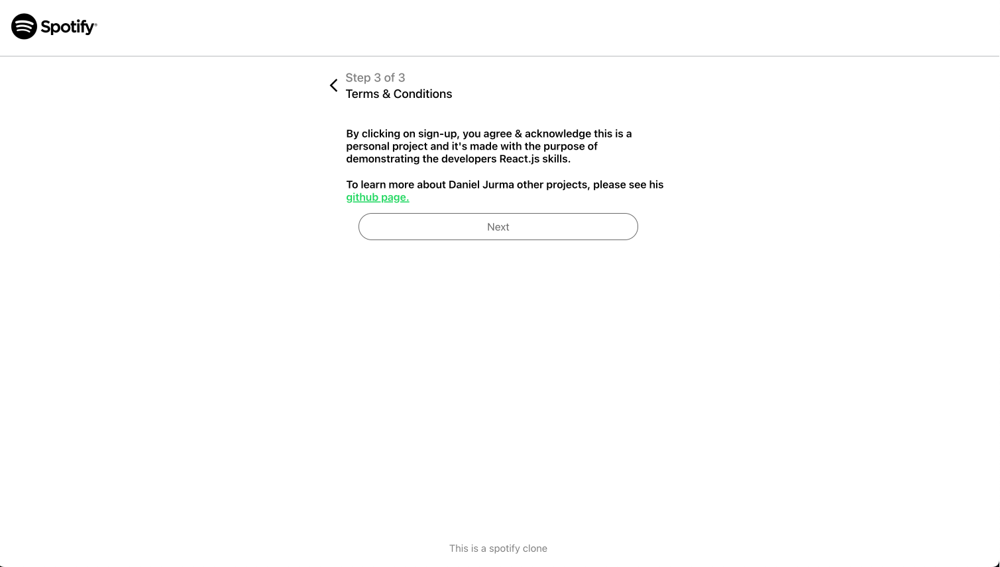

# Spotify Clone


This project is an Spotify clone developed using React.js and TypeScript. It includes features such as user authentication/registration, displaying user playlists, searching tracks. The project also utilizes Redux for global state management and Firebase for backend services.

## 🔗 Developer

[](https://www.linkedin.com/in/daniel-jurma/)


## Key Features

- User Authentication: Allow users to sign in using their Spotify accounts via the Spotify Web API.
- User playlists: Sync with the user's Spotify account to display their playlists.
- Track search: Enable users to search for tracks, albums and artists using the Spotify API.
- Playing audio: Enable users to play preview of the songs that they chose to listen to.
- UI Design: Modern UI with MUI.
- State Management: Efficient state management with Redux.

## Technologies Used


- **React.js**: Popular open-source JavaScript framework for web app development.
- **Typescript**: Superset of JavaScript with optional static typing for improved code quality and tooling.
- **Redux**: Predictable state container for managing application state in JavaScript apps.
- **Git**: Version control system for tracking code changes and facilitating collaboration.
- **npm**: JavaScript package manager for easy dependency management.
- **Firebase**: A comprehensive backend-as-a-service (BaaS) platform provided by Google.
- **Visual Studio Code**: Popular code editor with rich features for code editing and debugging.
- **Figma**: Web-based design tool for creating UI/UX designs and prototypes.


## Configuration

Before running the application, you need to configure Firebase services. Follow the steps below:

Create a Firebase project at https://firebase.google.com if you haven't already.
- Enable Firebase Authentication.
- Obtain the Firebase configuration object from the Firebase console.
- Update the Firebase configuration in the project code.
- Create a folder "config" with file firebase.ts and replace the following lines with your Firebase configuration:

```bash
import { initializeApp } from "firebase/app";
import { getAuth } from 'firebase/auth'

const firebaseConfig = {
    apiKey: "",
    authDomain: "",
    projectId: "",
    storageBucket: "",
    messagingSenderId: "",
    appId: ""
};

// Initialize Firebase
const app = initializeApp(firebaseConfig);
export const auth = getAuth(app);


```
    

## Deployment

To deploy this project run

```bash
  npm start
```


## Screnshots





## UI Libraries

- **<a href="https://mui.com/" target="_blank">MUI</a>**: A customizable UI library for React.js that provides various UI components.

## Problem Approach
- Carefully examined the project requirements to determine the unique functionalities needed for each application.
- Conducted comprehensive research to assess various technologies and frameworks, considering factors like cross-platform compatibility performance, and developer-friendliness.
- Established the development environment by configuring essential tools, libraries, and dependencies.
- Adopted a modular architecture pattern to promote the separation of code into reusable components, which facilitates better separation of concerns and more efficient testing.
- Leveraged Git for collaborative development, efficient code management, and precise tracking of changes.

## If time was infinite
 Given infinite time, here are some exciting features I would add to enhance the user experience:
- Create playlist option: Implement a feature that allows users to create and manage playlists.
- Artist Page:: Design a dedicated artist page where users can explore and learn more about their favorite musicians.
- Like Song Functionality: Enable users to like and save their preferred songs with a simple "like" button.

## Contributing
Whether you use this project, have learned something from it, or just like it, please consider supporting it by buying me a coffee, so I can dedicate more time on building open-source projects like this :)

<a href="https://www.buymeacoffee.com/djurma" target="_blank">
  
</a>

## License
The Spotify Clone Clone is open-source and released under the [GNU General Public License](https://choosealicense.com/licenses/gpl-3.0/)

## Contact
For any inquiries or questions regarding the Spotify Clone application, please contact me at d_jurma@yahoo.com


    
